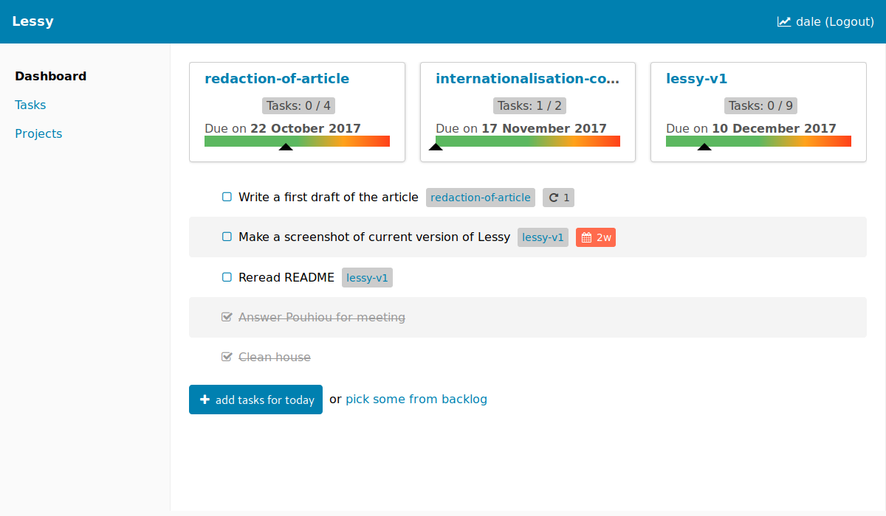

# Lessy

Lessy is a time manager application built upon strong principles. It is
designed to be as **intuitive and inclusive** as possible. Its goal is to
help people to recover their **power to manage time**, instil
**self-confidence** and challenge their **capacity to question themselves**. It
is built by a **diverse and welcoming community**.

Every feature we develop, every discussion we have, every decision we make MUST
support this vision.

We want Lessy to be very different of other "project managers" or "todo-list
applications".

Compared to Todoist, Trello, Wunderlist and all similar commercial applications,
Lessy is built by a non-commercial community. It means that all decisions are
made by users for the users. Money never appears in this equation!

Lessy is not only different from a commercial point of view, it is also
different compared to the vast majority of other free softwares. Indeed, by
making our goal explicit, we try to solve a specific problem. It means we
cannot accept contributions that doesn't match the vision we have of the
project.

Our bet is that will **make Lessy better over the long-term**.

More specifically, Lessy will help you:

- To collect ideas you have in mind.
- To organize these ideas in projects and/or tasks depending on their
  complexity.
- To identify what's important to do at the present moment.

## Getting started

If you simply want to start to use Lessy, just **go to [lessy.io](https://lessy.io)**
and create an account.

If you want to give feedback or report a bug and you are not at ease with
GitHub, you can start by [joining us on Framateam](https://framateam.org/lessy).
The chat is not very active yet but feel free to leave a message and we'll try
to welcome you as well as possible.

If you already have a GitHub account, you can directly create an "issue" on our
[bugtracker](https://github.com/lessy-community/lessy/issues/).

You might be interested to know **what will be next big features** of Lessy. We
do not maintain any official roadmap. However, we are using small iterations to
plan future work. An iteration is represented by a GitHub milestone and it
groups a set of related features or technical issues. [Have a look to current
milestones](https://github.com/lessy-community/lessy/milestones). Note that
iterations are named after [constellations' name](https://en.wikipedia.org/wiki/88_modern_constellations)
to remind us to look at the stars sometimes.

Also, the work being done is tracked on our ["Current work" project board](https://github.com/lessy-community/lessy/projects/9).

If you're an advanced user, you may prefer to **host Lessy on your own server**.
That's the preferred option if you care about your data and we're totally OK
with it. That's the reason we try to maintain [documentation to install Lessy](https://github.com/lessy-community/lessy/blob/master/docs/production_environment.md)
in production up-to-date.

## Community

Community is so important to us that it appears in our vision (detailed in
introduction of this document). Community is part of Lessy. We cannot make a
useful and used application without the implication of people that are
different from us. We want to work as a **diverse and inclusive community**.

Contribution to the project is opened to everyone as long as our vision makes
sense to you. You can start by reading our **[contribution guide](CONTRIBUTING.md)**.
Our ground rules are detailed in our **[code of conduct](CODE_OF_CONDUCT.md)**,
we strongly encourage you to read it.

Also, all contributors are listed in our [contributors file](CONTRIBUTORS.md),
it can be interested to better know who you might be working with if you join
us! This file is also a way to thanks every person that took of their time to
contribute in a way or another.

## License

Lessy is distributed under [MIT license](https://opensource.org/licenses/MIT).
It is free ([as in free speech](https://en.wikipedia.org/wiki/Gratis_versus_libre))
and always will be!

## Credits

Lessy would definitely not be the same without these different projects:

- [Ruby on Rails](http://rubyonrails.org/)
- [VueJS](https://vuejs.org/)
- [PostgreSQL](https://www.postgresql.org/)
- and all the others smaller projects listed in our [Gemfile](Gemfile) and our
  [package.json file](client/package.json)

Also, our documentation received a lot of attention and we send special thanks
to the [Open Source Guides](https://opensource.guide/) project (by GitHub) that
gives great advices to build free software communities. And more specifically,
we used following resources:

- [Making READMEs readable](https://open-source-guide.18f.gov/making-readmes-readable/)
- [Contributing Guides: A Template](https://github.com/nayafia/contributing-template/blob/master/CONTRIBUTING-template.md)
- [Django Code of Conduct](https://www.djangoproject.com/conduct/enforcement-manual/)
- [Contributor Covenant](https://www.contributor-covenant.org/version/1/4/code-of-conduct.html)
